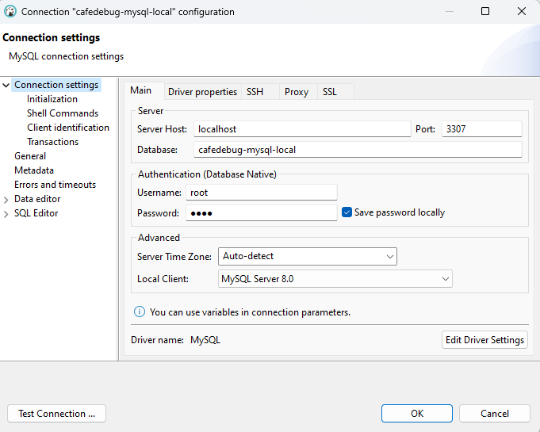

# debug-automation
The project is for automation, allowing you to run various projects in containers. You can configure any APIs and databases using shell scripts that run within the containers.

## Project information 📑

- 📂 **Applications** - each application should have a folder and contain its own separate informations

- 📂 **Databases** - database scripts for create tables and insert

- 📂 **Scripts** - applications scripts shell to configure database and APis in container, called docker-compose file

- 🐋 **Docker-compose** - to configure services, containers and ports of database 


## Setup 🔧
To database configure in local environment, following this steps. Notes for each one project script you run, must grant permission in chmod.

- Before running the project, configure access permission for this script. Enter the command in terminal (WSL, PowerShell, CMD, etc)

```bash
 chmod +x cafedebug-setup.sh
```
- Select the project for which you want to run the script to configure the database.

```bash
 ./cafedebug-setup.sh
```


- To generate users data

```bash
 chmod +x data-generator-setup.sh
```

```bash
 
 ./data-generator-setup.sh
```

## Tests and Run 🧪
For test you connection database in DBaver following this steps:



- Server Host: localhost
- Port: 3307  (the door mapped in your docker-compose.yml)
- Username: root (the door mapped in your docker-compose.yml)
- Password: root (the door mapped in your docker-compose.yml)

